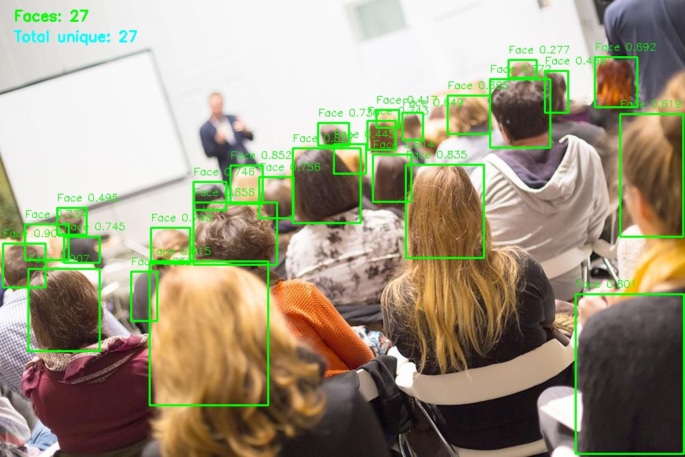

# Отчет по проекту: Интеллектуальная система компьютерного зрения для анализа заполненности аудиторий

## Описание проекта

Разработана система компьютерного зрения для автоматического подсчета количества людей в учебных аудиториях на основе изображений с камер видеонаблюдения. Проект решает задачу мониторинга заполненности помещений в образовательных учреждениях.

## Архитектура решения

### Модель детекции
- **Базовая модель**: YOLOv8n (nano версия)
- **Причина выбора**: Оптимальное соотношение скорости и точности для работы в реальном времени
- **Класс детекции**: 1 класс - "person"

### Датасет
- **Исходные данные**: 91 изображение (72 train + 19 validation)
- **Аугментация**: Добавлены негативные примеры для улучшения качества детекции

### Дополнение датасета
Для повышения robustness модели добавлены:
- **Пустые аудитории** - обучение корректно определять отсутствие людей
- **Изображения стульев** - снижение ложных срабатываний на мебель
- **Локти и частичные обзоры** - улучшение детекции в сложных условиях
- **Стоящие люди (преподаватели)** - отдельная категория для учета

## Процесс обучения

### Параметры тренировки
- **Эпохи**: 100
- **Размер изображения**: 1024x1024
- **Batch size**: 4
- **Оптимизатор**: AdamW
- **Learning rate**: 0.001 с warmup
- **Аугментация**: Randaugment, цветовые преобразования, flip

### Метрики качества
После обучения достигнуты следующие показатели:
- **mAP50**: 0.709
- **mAP50-95**: 0.332

### Ключевые особенности реализации
1. **Ансамблевый подход** - комбинирование предсказаний для повышения точности
2. **Постобработка** - фильтрация дубликатов и ложных срабатываний
3. **Визуализация результатов** - генерация размеченных изображений для анализа

## Технические особенности

### Оптимизации
- Работа на CPU для широкой совместимости
- Баланс между скоростью и точностью
- Эффективная обработка больших изображений (1024px)

### Обработка edge-cases
- Корректная работа с пустыми аудиториями
- Устойчивость к перекрытиям и частичным обзорам
- Фильтрация мебели и других объектов

## Преимущества решения

1. **Легковесность** - модель YOLOv8n обеспечивает высокую скорость работы
2. **Точность** - mAP50 70% на валидационной выборке
3. **Масштабируемость** - возможность обработки потокового видео
4. **Адаптивность** - дообучение на специфичных данных образовательных учреждений
